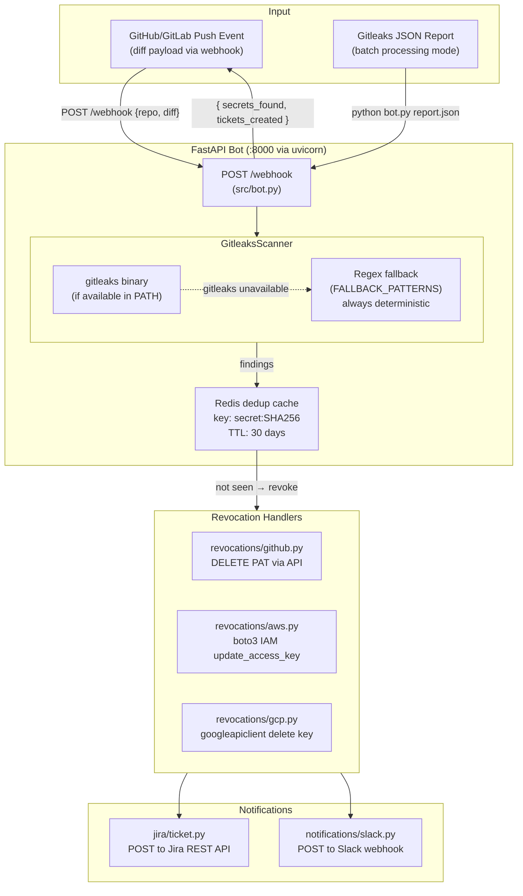

# Architecture — secret-sprawl-remediation-bot
> Last updated: 2026-08-29 | Maturity: Functional Prototype
> _Real closed-loop secret remediation pipeline: webhook → scan → revoke → alert → ticket. Gitleaks binary optional — in-process regex fallback always active. Jira/Slack use real HTTP clients against mocked/configurable endpoints._

---

## System Architecture

---

## Component Table

| Component | File | Responsibility | Tech |
|---|---|---|---|
| FastAPI webhook | `src/bot.py` | `POST /webhook` — orchestrates scan → revoke → notify | FastAPI, Python |
| Gitleaks scanner | `src/bot.py:GitleaksScanner` | Primary: `gitleaks detect` subprocess; Fallback: `FALLBACK_PATTERNS` regex | Python subprocess / re |
| Redis dedup | `src/bot.py` | Prevents duplicate processing; 30-day TTL per secret hash | Redis (real/mocked) |
| GitHub revocation | `revocations/github.py` | `DELETE https://api.github.com/...` PAT revocation | httpx |
| AWS revocation | `revocations/aws.py` | `boto3` IAM `update_access_key(Status=Inactive)` | boto3 |
| GCP revocation | `revocations/gcp.py` | `googleapiclient` service account key deletion | google-api-python-client |
| Jira ticketing | `jira/ticket.py` | `POST /rest/api/2/issue` to create incident ticket | httpx |
| Slack notification | `notifications/slack.py` | `POST` to Slack incoming webhook | httpx |
| Root CLI bot | `bot.py` | Batch mode: reads Gitleaks JSON report, POSTs findings to mock API | Python, requests |
| Mock API | `mock_api/server.py` | Flask server simulating IdP revocation endpoints for local testing | Flask |

---

## Port Assignments

| Service | Port | Notes |
|---|---|---|
| FastAPI (uvicorn) | 8000 | `POST /webhook` |
| Mock Flask API | 5000 | Local IdP simulation for batch mode |
| Redis | 6379 | Via `docker-compose.infra.yml` or local |

---

## Secret Detection — Fallback Patterns

When `gitleaks` binary is not in PATH, `GitleaksScanner._scan_with_regex()` activates:

| Pattern | Provider | Covers |
|---|---|---|
| `AKIA[0-9A-Z]{16}` | `aws` | AWS Access Key IDs |
| `api[_-]?key\s*[=:]\s*...{20,}` | `generic` | API key assignments |
| `ghp_[A-Za-z0-9]{36}` | `github` | GitHub PATs (classic) |
| `secret\|password\|token...\s*=\s*...{32,}` | `generic` | High-entropy credential assignments |

---

## Dependency Table

| Dependency | Status | Notes |
|---|---|---|
| `gitleaks` binary | **Optional** | Falls back to regex if not installed |
| Redis | **Optional (graceful)** | If Redis unavailable, dedup is skipped — secrets are re-processed each time |
| `boto3` (AWS) | **Real / mocked in tests** | Tests mock boto3; production requires `AWS_*` credentials |
| `googleapiclient` (GCP) | **Real / mocked in tests** | Tests mock discovery.build; production requires GCP service account |
| Jira REST API | **Real / configurable** | Requires `JIRA_URL`, `JIRA_USER`, `JIRA_TOKEN` env vars; skipped if not set |
| Slack webhook | **Real / configurable** | Requires `SLACK_WEBHOOK_URL` env var; skipped if not set |
